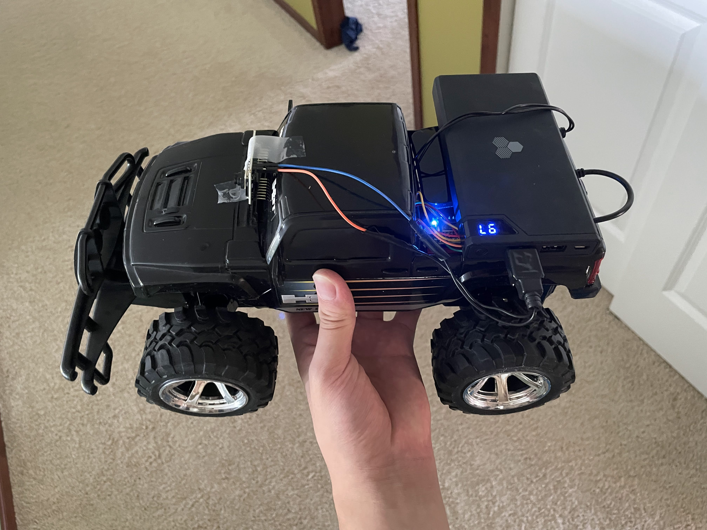

# WiFi RC Car

Web interface adapted from: https://github.com/GungorYalcin/ArduinoDersleri/blob/master/gy_NodeMCU_Wifi_Robot_Car_Webservis/gy_NodeMCU_Wifi_Robot_Car_Webservis.ino

This project features a WiFi controlled RC car, powered by a NodeMCU controller. I lost the remote for the original RC car, a New Bright Hummer H3T, and decided to update it with some modern features. The original motor control circuitry required too much modification, so I decided to replace it with four relays. The main drive motor and steering motor each have 2 relays in a relay H Bridge configuration for forward and reverse and are directly connected to the power source, which I used a USB power brick for. 

## Pin bindings: 
- GPIO5 and GPIO4 for the drive motor
- GPIO0 and GPIO2 for the steering motor

I also added a ESP32 CAM board running the default web server video streaming program (CameraWebServer in ESP32 Examples in the ESP32 Arduino Library) to act as a video feed from the car. I reccomend using a seperate USB power brick for the ESP8266 and ESP32 in order to prevent current spikes from the motors causing the boards to brown out.

## Setup Guide:
1. Download code and install ESP8266 Arduino Library
2. Enter your WiFi SSID and password into the code, then flash the program onto the NodeMCU
3. Tear down RC car and install relay H Bridges onto the motors (you will probably have to do some testing to get this to work), and wire a USB plug as the power source for motors. 
4. Connect the USB power for the motors and for the NodeMCU
5. Open the serial monitor to get the link for the car's web interface, then control the car from there!